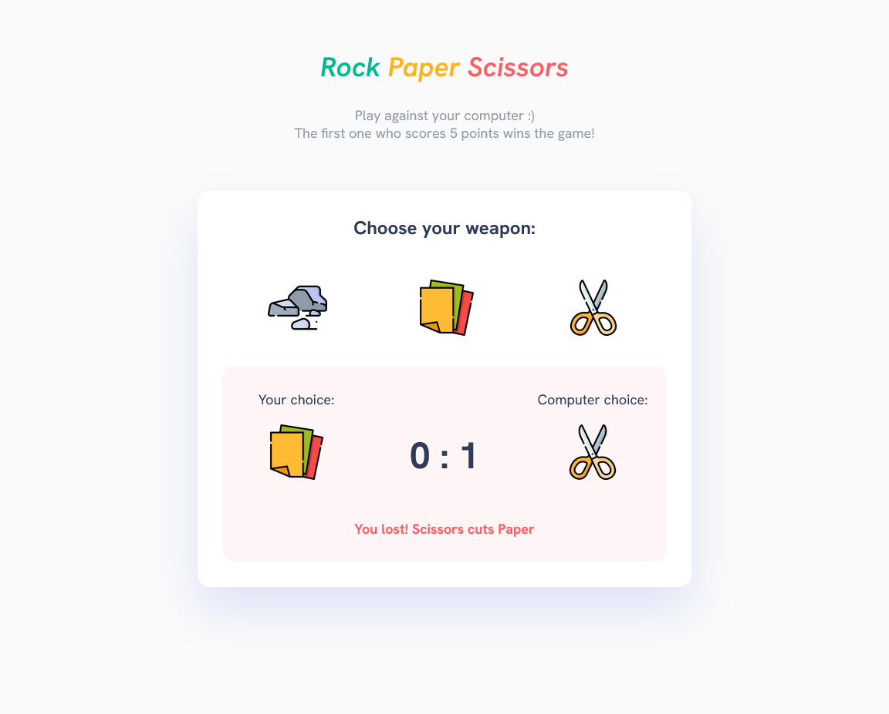
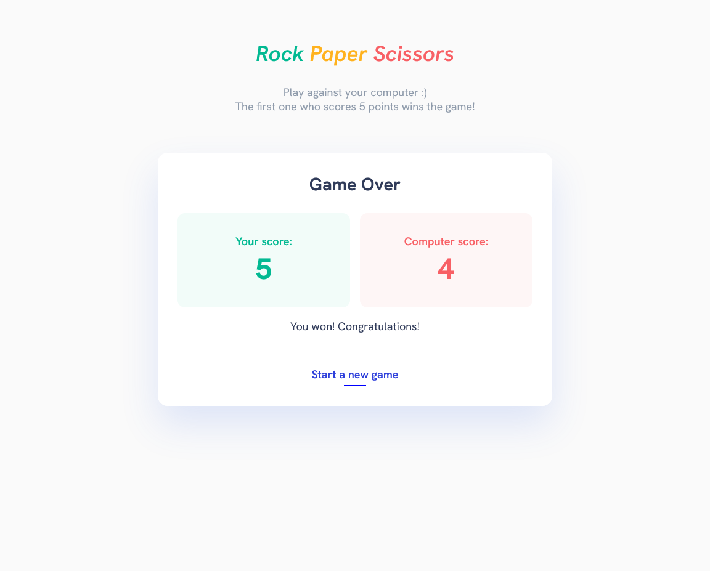

This is a classic Rock Paper Scissors game, where you can play against your computer.  [👉Live Site URL👈](https://bohuslava-p.github.io/rock-paper-scissors/)

- [Overview](#overview)
    - [The challenge](#the-challenge)
    - [Screenshots](#screenshots)
    - [Built with](#built-with)
    - [What I learned](#what-i-learned)

## Overview

### The challenge

Game should: 

- Have an ability for the player to choose a weapon for a game round
- Include logic for the classic "Rock Paper Scissors" game
- Show the result of each round
- Last, until someone scores 5 points
- Show the final result (who won and who lost)

### Screenshots

### Built with

- Semantic HTML5 markup
- CSS custom properties
- Flexbox
- JavaScript

### What I learned

- JS DOM manipulation & events
- CSS animations
- Usage of EM & REM units for better accessibility and responsiveness